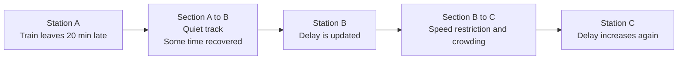
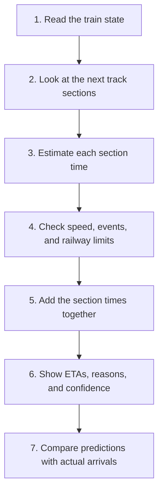
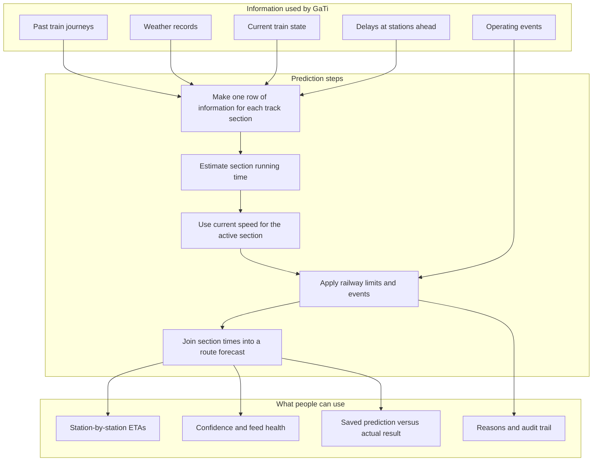
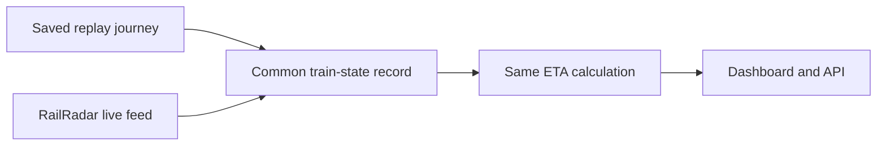
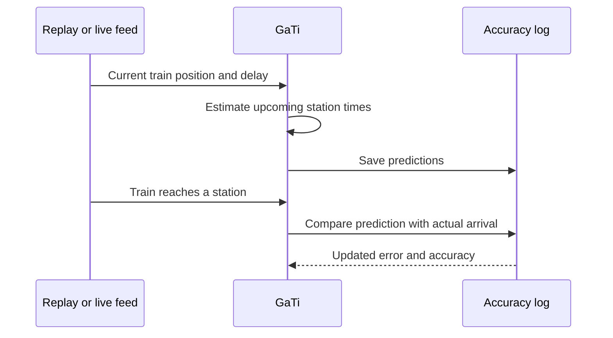

<p align="center">
  
</p>

<h1 align="center">GaTi: A Clearer ETA for Indian Railways</h1>

<p align="center">
  GaTi estimates when a train will reach each upcoming station.
  It uses the train's history, its current condition, the track ahead,
  weather, and railway operating limits.
</p>

<p align="center">
  <a href="#results-in-simple-words"></a>
  <a href="#results-in-simple-words"></a>
  <a href="#start-here"></a>
  <a href="#check-that-it-works"></a>
</p>

## What is GaTi?

GaTi is a train arrival-time prediction system. Give it a train's current station,
current delay, route, weather, and information about trains farther ahead. It returns:

- an expected arrival time for every upcoming station;
- the expected delay at every station;
- a confidence score that becomes lower farther into the future or when information is old;
- a plain explanation when a rule, speed restriction, stop, weather condition, or crowding changes the result.

The name **GaTi** means movement or speed. The project is a research and demonstration
system. It is not a certified signalling system and must not replace an authorised
railway controller, signal, or emergency procedure.

## Start here

### The problem in one example

Imagine this situation:

- Train A leaves Station A **20 minutes late**.
- Station B is quiet, so Train A can recover some time.
- Station C is crowded because other trains are waiting there.
- A temporary speed restriction slows the track between B and C.

A simple system would add 20 minutes to every later station. That gives the same answer
whether Station C is empty or blocked. GaTi gives a different answer for each section:



The important idea is simple: **the answer is rebuilt section by section**. The system
does not copy the first delay all the way to the destination.

## What the system does, step by step



### Step 1: Read the train state

GaTi can use either a saved journey replay or an external live feed. It reads things
such as:

- train number and journey date;
- current station and next station;
- current delay;
- speed and progress between two stations;
- latitude and longitude when available;
- when the observation was received;
- whether the position is confirmed or estimated.

All sources are changed into the same small record before prediction. This means the
prediction code does not need separate logic for replay data and live data.

### Step 2: Look ahead

A train is affected by what is happening farther down the line. GaTi checks the next
one, two, and three stations and asks:

- How late are trains at the next station?
- How many trains are there?
- Is the delay getting worse or better?
- What was the average delay during the last few hours?

This is similar to checking traffic ahead before driving into a busy town. Trains
cannot simply steer around a blocked platform, so this information matters.

### Step 3: Estimate each section

A **section** means the track between two consecutive stations. For example:

```text
New Delhi -> Ghaziabad -> Aligarh -> Kanpur
             section 1     section 2    section 3
```

The trained model estimates the running time of each section. It learns from timetable
records, actual running times, distance, delays, weather, traffic, and railway zone.
It predicts time in minutes, not a final destination time in one giant guess.

### Step 4: Check the answer

The model is good at finding patterns, but it does not understand railway safety by
itself. GaTi checks every answer before showing it:

- it will not predict a speed above the section's maximum allowed speed;
- it limits unrealistic time recovery;
- it adds the effect of a caution order or temporary speed restriction;
- it adds a maintenance hold, signal hold, or unscheduled stop;
- it records what changed and why.

### Step 5: Add the times

If the train has 12 minutes left on the next section and 18 minutes on the following
section, the second station is predicted roughly 30 minutes from now, plus any planned
dwell time. The calculation continues until the destination.

### Step 6: Show the result

The API and dashboard show a station table like this:

| Station | Scheduled arrival | GaTi arrival | Predicted delay | Confidence | Explanation |
| --- | --- | --- | ---: | ---: | --- |
| Station B | 10:20 | 10:24 | +4 min | High | Normal section running |
| Station C | 10:55 | 11:08 | +13 min | High | Downstream crowding |
| Station D | 11:30 | 11:48 | +18 min | Medium | 30 km/h caution order |

The exact values depend on the selected replay journey or live observation.

## The complete picture



## The project parts in plain language

| Part | File or folder | What it does |
| --- | --- | --- |
| Data preparation | `src/data/` | Cleans station, track, train, and weather information. |
| Feature list | `src/model/features.py` | Defines exactly which pieces of information the model receives. |
| Trained model | `models/lightgbm_eta.txt` | Estimates the time for one track section. It is a fast tree-based model. |
| Track-ahead information | `src/engine/network_state.py` | Reads delays and train counts at stations ahead. |
| Current-speed adjustment | `src/engine/state_correction.py` | Uses current speed and progress for the section the train is travelling now. |
| Safety and event checks | `src/engine/rule_engine.py` | Prevents impossible times and adds known operating events. |
| ETA calculator | `src/engine/eta_calculator.py` | Runs the full prediction from the current station to the destination. |
| Data sources | `src/integrations/` | Connects saved replay journeys and the RailRadar live service. |
| Replay | `src/replay/` | Moves through a saved journey one station at a time. |
| Web API | `src/api/main.py` | Makes predictions and results available to the dashboard and other programs. |
| Dashboard | `frontend/` | Shows the map, train state, station ETAs, alerts, and what-if events. |
| Tests | `tests/` | Check calculations, API responses, data rules, leakage, speed, and failure cases. |

## The formulas used by the project

The formulas below describe the calculations in ordinary language first. The symbols are
included so that the implementation can be checked precisely.

### 1. Section prediction

For section $k$, the model receives information $x_k$ and estimates its running time:

$$
\text{estimated section time}_k=f(x_k)
$$

Examples in $x_k$ include distance, timetable time, current delay, weather, train
count, and delay at the next stations.

### 2. Arrival time

The next arrival time is the current time plus the final section time:

$$
\text{next arrival}=	ext{current time}+\text{final section time}
$$

For many stations, GaTi repeats this calculation:

$$
A_k=A_{k-1}+t_k
$$

- $A_k$ is the predicted arrival time at station $k$.
- $t_k$ is the checked running time for the section before station $k$.

### 3. Delay

The predicted delay is the difference between predicted arrival and scheduled arrival:

$$
\text{predicted delay}=\text{predicted arrival}-\text{scheduled arrival}
$$

If the train is predicted at 11:08 and the schedule says 10:55, the predicted delay is
13 minutes.

### 4. Fastest physically possible time

A 25 km section with a maximum speed of 100 km/h cannot take less than 15 minutes:

$$
\text{minimum time}=\frac{\text{distance}}{\text{maximum speed}}\times 60
$$

$$
\frac{25}{100}\times60=15\text{ minutes}
$$

If the model says 10 minutes, the rule engine changes it to at least 15 minutes and
records that change. This prevents a model mistake from becoming an impossible speed.

### 5. Temporary speed restriction

Suppose 15 km normally takes place at 100 km/h but a caution order limits that part to
30 km/h. The added time is:

$$
	ext{added time}=60d\left(\frac{1}{v_{\text{restricted}}}-\frac{1}{v_{\text{normal}}}\right)
$$

$$
60(15)\left(\frac{1}{30}-\frac{1}{100}\right)=21\text{ minutes}
$$

GaTi adds 21 minutes and places the reason in the audit trail.

### 6. Current speed and remaining distance

If the train has travelled 40% of a 50 km section, 60% remains:

$$
\text{remaining distance}=\text{section distance}\times(1-\text{progress})
$$

$$
50(1-0.40)=30\text{ km}
$$

The live-speed estimate is then:

$$
	ext{live time}=\frac{\text{remaining distance}}{\text{current speed}}\times60
$$

For a fresh moving observation, GaTi blends 70% of the model's remaining-time estimate
with 30% of this live-speed estimate. This affects only the active section.

### 7. Confidence score

The displayed confidence is a practical score, not a promise that the answer is correct.
It starts at 95 and is adjusted for distance, weather, crowding, train density, and
feed quality:

$$
C=\operatorname{clip}(95-1.5h-5w-p+d+q,25,98)
$$

In plain language:

- farther stations reduce confidence by 1.5 points per station;
- fog or heavy rain reduces it by 5 points;
- serious downstream delay reduces it by 4 points;
- a fresh live feed can increase it by 2 points;
- stale or estimated data reduces it;
- the final score stays between 25 and 98.

## Live mode and saved replay mode

GaTi has two ways to receive a train state:



### Saved replay

Replay is useful for demonstrations and repeatable tests. It loads a known journey and
moves from station to station. The actual arrival at the next station can then be
compared with the earlier prediction.

### Live feed

Live mode uses the RailRadar adapter when configured. The adapter reports connection
health, request count, response time, cache use, and whether fallback is active.
A missing or failed live feed should not crash the prediction path.

### Feed age

| Name | Feed age | Meaning |
| --- | --- | --- |
| `FRESH` | 0 to 60 seconds | Current information is trusted most. |
| `AGING` | 61 to 180 seconds | Current speed is trusted less. |
| `STALE` | More than 180 seconds | The system uses a more cautious estimate. |
| `UNKNOWN` | No usable time | There is no freshness benefit. |

## Four train movement situations

The current-speed code treats a stopped train differently depending on where it is:

| Situation | Meaning | Action |
| --- | --- | --- |
| `MOVING` | Speed is at least 15 km/h. | Blend the model with live speed when the feed is fresh. |
| `SLOW_MOVING` | Speed is between 5 and 15 km/h. | Use a cautious blend because the train may be in a yard or under restriction. |
| `STATION_HALT` | Speed is below 5 km/h at the beginning or end of a section. | Treat it as a normal station stop. |
| `UNEXPECTED_STOP` | Speed is below 5 km/h in the middle of a section. | Add a three-minute signal or precedence hold buffer. |

This distinction matters: a train stopped at a platform is normal, while a train stopped
in the middle of the track may be waiting for a signal or another train.

## Railway events and what-if examples

You can test an event without changing the saved data. Supported examples are:

- `SPEED_RESTRICTION`: a section has a lower speed;
- `CAUTION_ORDER`: a formal speed caution is active;
- `MAINTENANCE_BLOCK`: work temporarily holds the line;
- `UNSCHEDULED_STOP`: the train must wait;
- `SIGNAL_HOLD`: the route is waiting for clearance;
- `CANCELLATION`, `DIVERSION`, and `RESCHEDULE`: larger route changes recorded by the rule engine.

Example: add a 40 km/h caution over 10 km.

```powershell
curl.exe -X POST http://127.0.0.1:8000/api/events/inject `
  -H "Content-Type: application/json" `
  -d '{"event_type":"CAUTION_ORDER","from_station":"HWH","to_station":"BWN","restricted_speed_kmh":40,"affected_km":10,"source_type":"CAUTION_ORDER"}'
```

Clear all test events:

```powershell
curl.exe -X POST http://127.0.0.1:8000/api/events/clear
```

Every adjustment contains the old value, the new value, the difference, a reason, and
where the rule came from. This makes it possible to answer: **Why did this ETA change?**

## Data used by the model

| Data | What it tells GaTi |
| --- | --- |
| Train movement records | How long sections actually took. |
| Timetable data | Planned arrival, departure, dwell, and section time. |
| Station and track data | Which stations are connected and how far apart they are. |
| Weather data | Temperature, rain, wind, visibility, fog, and heavy rain. |
| Station-hour grid | Recent delay, delayed-train count, and active-train count at stations. |
| Live or replay state | Current delay, speed, progress, and feed age. |

### Keeping future information out

The project separates time into three periods:

$$
\text{Train: Sep 1--22}\rightarrow\text{Check: Sep 23--26}\rightarrow\text{Test: Sep 27--30, 2024}
$$

The model learns from the first period, is checked during the second, and is finally
measured on the last period. Historical averages are made from training records before
they are used for later dates. Station delay lookups use earlier hours, not future hours.
This prevents the answer from secretly using information that would not have been known
at prediction time.

The rule is tested in [tests/test_no_leakage.py](tests/test_no_leakage.py).

## What information enters the model?

The basic model uses these groups of information:

| Group | Examples | Why it helps |
| --- | --- | --- |
| Timetable and distance | Planned section time, distance, dwell time | Describes the normal journey. |
| Current delay | Arrival and departure delay at the last station | Shows what delay is already being carried forward. |
| Past section times | Median, average, slowest usual time, variation | Describes how this piece of track normally behaves. |
| Traffic and calendar | Train count, hour, weekday, weekend | Captures busy periods and different days. |
| Weather | Temperature, rain, visibility, fog, wind | Captures conditions that change running time. |
| Railway zone | Zone such as NR, ER, or SR | Captures regional operating differences. |
| Track-ahead state | One-, two-, and three-station delay signals | Warns about problems before the train reaches them. |

The project tests four versions of the model:

| Version | What it adds | Test MAE |
| --- | --- | ---: |
| M0 | Basic train, track, time, and weather information | 6.247 minutes |
| M1 | Delay and train counts at the next station | 6.237 minutes |
| M2 | Information from two and three stations ahead | 6.249 minutes |
| M3 | Recent and rolling delay patterns | 6.251 minutes |

M3 is the full 34-feature version used by the current prediction path. The differences
are small, so all versions are kept as useful comparison points rather than claiming
that every extra input always improves the score.

## Results in simple words

These values come from `models/evaluation_summary.json` and use unseen dates from
September 27 to 30, 2024.

| Method | Average error | Within 5 minutes | What it means |
| --- | ---: | ---: | --- |
| Schedule-only estimate | 8.600 min | 62.06% | Uses the timetable and current delay only. |
| Historical section average | 8.419 min | 62.34% | Uses what the same section usually does. |
| Full M3 model | **6.251 min** | **71.85%** | Uses timetable, history, weather, and track-ahead information. |
| M3 plus rule checks | 6.913 min | 68.18% | Adds hard physical and operating limits. |

The rule-checked result is shown separately because safety checks and prediction accuracy
are different goals. A rule may make an estimate slightly less close to an old test value
while preventing an impossible speed. Both results matter.

The project also stores:

- `models/horizon_evaluation.json`: accuracy at different numbers of stations ahead;
- `models/scenario_evaluation.json`: accuracy for on-time, delayed, and severely delayed trains;
- `models/network_pressure_evaluation.json`: accuracy at different levels of crowding;
- `models/rule_impact_evaluation.json`: changes made by the rule checks;
- `logs/prediction_eval_log.jsonl`: predictions compared with later observed arrivals.

## API guide

Start the server, then open `http://127.0.0.1:8000/docs` for interactive API documentation.
The most useful calls are:

| Method | Address | What it does |
| --- | --- | --- |
| `GET` | `/api/trains` | Shows the four ready-made demo journeys. |
| `GET` | `/api/trains/catalog?search=12303` | Searches the train catalog. |
| `POST` | `/api/replay/train` | Selects a train and date for replay. |
| `GET` | `/api/replay/state` | Shows the current station and all upcoming predictions. |
| `POST` | `/api/replay/step` | Moves replay to a station and checks the previous prediction. |
| `POST` | `/api/mode/switch` | Selects replay or live mode. |
| `GET` | `/api/live/health` | Shows live-feed health. |
| `GET` | `/api/live/provider/status` | Shows the active source and fallback state. |
| `GET` | `/api/live/state` | Shows current live state and predictions. |
| `GET` | `/api/live/station/{code}` | Shows the station board. |
| `GET` | `/api/network-state/{station_code}?hour=12` | Shows delay and train count at a station. |
| `GET` | `/api/alerts` | Shows active delay, event, feed, and crowding alerts. |
| `POST` | `/api/events/inject` | Adds a test event. |
| `POST` | `/api/events/clear` | Removes test events. |
| `GET` | `/api/predictions/log` | Shows running prediction accuracy. |
| `GET` | `/api/benchmarks` | Returns the main saved results. |
| `GET` | `/api/benchmarks/horizon` | Returns results by distance into the journey. |
| `GET` | `/api/benchmarks/scenarios` | Returns results by delay size. |
| `GET` | `/api/benchmarks/rules` | Returns rule-check results. |
| `GET` | `/api/benchmarks/network-pressure` | Returns results by station crowding. |
| `GET` | `/api/benchmarks/ablation-ladder` | Returns M0 to M3 comparisons. |
| `GET` | `/api/feature-importance` | Shows which inputs mattered most to the model. |
| `GET` | `/api/demo/live-loop` | Runs a complete observe, predict, arrive, and check example. |

### Select a replay journey

```powershell
curl.exe -X POST http://127.0.0.1:8000/api/replay/train `
  -H "Content-Type: application/json" `
  -d '{"train_number":12303,"date":"2024-09-28"}'
```

### Read its current predictions

```powershell
curl.exe http://127.0.0.1:8000/api/replay/state
```

### Read the same result in Python

```python
import requests

server = "http://127.0.0.1:8000"
requests.post(f"{server}/api/replay/train", json={
    "train_number": 12303,
    "date": "2024-09-28",
}).raise_for_status()

state = requests.get(f"{server}/api/replay/state").json()
first_stop = state["comparison_table"][0]
print(first_stop["station_code"])
print(first_stop["our_predicted_eta"])
```

## Dashboard

The dashboard is served by the same FastAPI application. It brings together:

- current train position and delay;
- the next station and later station ETAs;
- the timetable versus GaTi comparison;
- network crowding and active alerts;
- live-feed age and fallback status;
- what-if event controls;
- prediction-versus-actual verification.

There is only one prediction engine. The dashboard calls the API; it does not make a
separate estimate in the browser.

## Quick setup

### Windows PowerShell

```powershell
py -m venv .venv
.\.venv\Scripts\Activate.ps1
python -m pip install --upgrade pip
pip install -r requirements.txt
python -m uvicorn src.api.main:app --host 127.0.0.1 --port 8000
```

Open these pages:

- Dashboard: `http://127.0.0.1:8000/`
- API documentation: `http://127.0.0.1:8000/docs`
- Alternative API documentation: `http://127.0.0.1:8000/redoc`

The saved replay works without a live API key.

### Docker

```powershell
docker compose up --build
```

For live mode, add these values to `.env` when available:

```text
RAILRADAR_API_KEY=your-key
RAILRADAR_BASE_URL=https://api.railradar.in/v1
```

## Check that it works

Run all tests:

```powershell
python -m pytest tests/ -v
```

The tests check:

- API responses and replay stepping;
- ETA calculations;
- data quality;
- live-feed fallback behavior;
- station-ahead delay calculations;
- future-data leakage;
- impossible speeds and operating events;
- speed and memory behavior.

Run the complete replay demonstration:

```powershell
curl.exe "http://127.0.0.1:8000/api/demo/live-loop?train_number=12303&date=2024-09-28"
```

That demonstration follows this loop:



## Folder guide

```text
.
├── data/                     Input, cleaned, and processed train data
├── docs/                     Detailed research and evaluation reports
├── frontend/                 Browser dashboard files
├── models/                   Trained model and saved result files
├── scripts/                  Benchmark and demonstration scripts
├── src/
│   ├── api/                  Web API
│   ├── data/                 Data cleaning and preparation
│   ├── engine/               ETA calculation, rules, network, and logging
│   ├── integrations/         Replay and external feed connections
│   ├── model/                Features, training, and evaluation
│   └── replay/               Saved journey simulator
├── tests/                    Automated checks
├── Dockerfile
├── docker-compose.yml
├── requirements.txt
└── package.json
```

Useful deeper documents:

- [Master system architecture](docs/master_system_architecture.md)
- [Evaluation methodology](docs/evaluation_methodology.md)
- [Data dictionary](docs/data_dictionary.md)
- [Leakage audit](docs/leakage_audit.md)
- [Live freshness policy](docs/live_freshness_policy.md)
- [Rule provenance](docs/rule_provenance.md)
- [Scalability report](docs/scalability_report.md)
- [Error analysis](docs/error_analysis.md)

## Important limits

- The training data is from September 2024. It cannot describe every future railway condition.
- A live external feed can be slow, unavailable, or wrong. Always show its health and age with the ETA.
- The confidence number is a useful warning score, not a guaranteed probability.
- The 15% recovery limit and some upper limits are project assumptions that railway experts should review.
- GaTi is decision support. It must not replace official signalling, dispatch, speed control, or emergency instructions.

## License

See [LICENSE.md](LICENSE.md).
