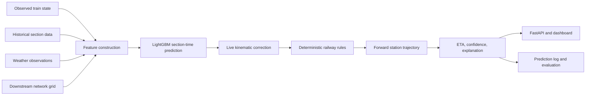
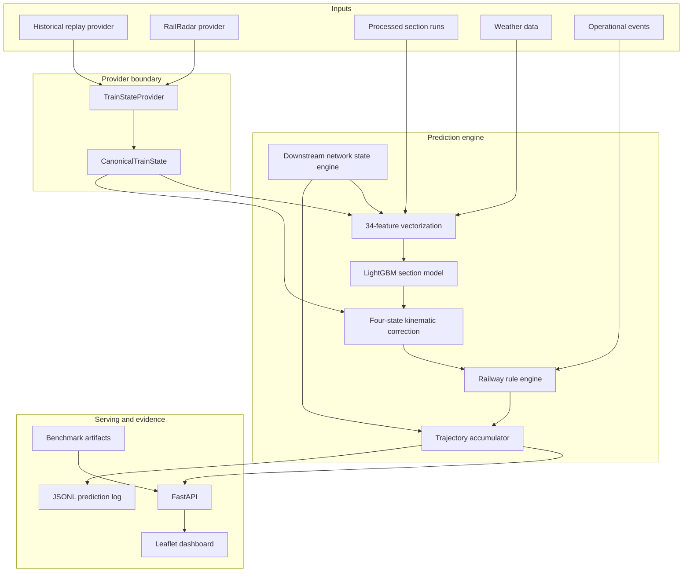
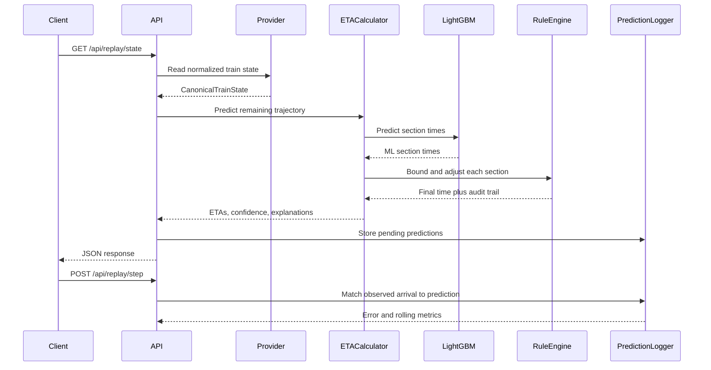
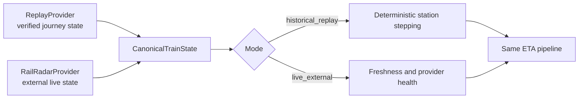
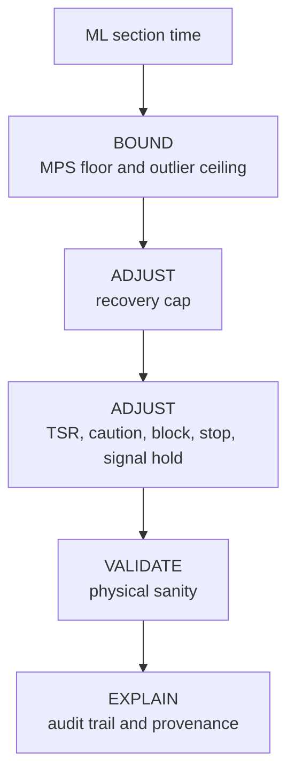

<p align="center">
  
</p>

<h1 align="center">GaTi: Dynamic ETA Prediction for Indian Railways</h1>

<p align="center">
  A station-by-station arrival forecast that combines historical operations, weather,
  downstream network pressure, live kinematics, and deterministic railway constraints.
</p>

<p align="center">
  <a href="#measured-results"></a>
  <a href="#measured-results"></a>
  <a href="#quickstart"></a>
  <a href="#verification"></a>
</p>

GaTi is an operational ETA engine for coaching trains. It predicts the time to every
remaining station on a route, explains why each prediction changed, and exposes the
result through a FastAPI service and a browser dashboard.

> **Status:** research and demonstration system. The included model, replay data, and
> external provider adapter are suitable for evaluation and integration experiments;
> they are not a safety-certified railway signalling system.

## Contents

- [At a glance](#at-a-glance)
- [Why this problem needs more than delay propagation](#why-this-problem-needs-more-than-delay-propagation)
- [System architecture](#system-architecture)
- [How one ETA is produced](#how-one-eta-is-produced)
- [Mathematical model](#mathematical-model)
- [Data and leakage controls](#data-and-leakage-controls)
- [Features and model tiers](#features-and-model-tiers)
- [Live mode and replay mode](#live-mode-and-replay-mode)
- [Operational rules and what-if events](#operational-rules-and-what-if-events)
- [Measured results](#measured-results)
- [API guide](#api-guide)
- [Dashboard](#dashboard)
- [Quickstart](#quickstart)
- [Verification](#verification)
- [Repository map](#repository-map)
- [Limitations and responsible use](#limitations-and-responsible-use)

## At a glance

| Question | GaTi's answer |
| --- | --- |
| What is predicted? | Running time for each remaining station-to-station section, then cumulative station arrival and departure ETAs. |
| What is the model? | LightGBM regression with L1/MAE loss. The production path uses 34 features: 22 numeric base features, 11 downstream-state features, and the categorical railway zone. |
| What makes it dynamic? | The current delay, current section progress, live speed, telemetry freshness, downstream station pressure, weather, and injected operational events are evaluated at request time. |
| What makes it explainable? | Every physical or operational adjustment is returned as an audit entry with its original time, final time, delta, reason, classification, and source document. |
| What happens if live data fails? | The provider abstraction falls back to replay/archive state instead of allowing the prediction request to crash. |
| What does the project include? | A Python inference engine, FastAPI API, replay simulator, RailRadar adapter, evaluation artifacts, tests, and a zero-framework Leaflet dashboard. |

### The core idea



## Why this problem needs more than delay propagation

A static delay rule says:

$$
\hat d_{k+1}=d_k
$$

That is simple, but it cannot represent recovery time, a crowded junction, a caution
order, or a train that has stopped between stations. GaTi instead predicts the next
section and then advances the forecast one section at a time:

$$
\hat t_{k}=f_\theta(x_k), \qquad
\hat A_{k}=\hat A_{k-1}+\hat t_{k}, \qquad
\hat d_{k}=\hat A_k-A^{schedule}_k
$$

Here, $x_k$ is the information available when section $k$ begins. Future observations
are not allowed into $x_k$; they are used only after the train reaches that station for
post-hoc evaluation.

The design addresses four concrete failure modes:

1. **Delay persistence is too rigid.** A train can recover a bounded amount of time on a clear section or lose time in congestion.
2. **A train is not independent of its corridor.** Delayed trains and occupied platforms at a downstream junction affect the next train approaching it.
3. **Unconstrained ML can predict impossible speeds.** A short predicted time is clamped to the time required by the section's maximum permissible speed.
4. **A live position is different from a timetable position.** Speed and progress are blended only for the immediate active section, with freshness-aware weights.

## System architecture



### Component responsibilities

| Component | Location | Responsibility | Why it exists |
| --- | --- | --- | --- |
| Data preparation | `src/data/` | Cleans station and edge data, builds section runs, and joins weather. | Keeps training data reproducible and separates raw data from inference. |
| Feature builder | `src/model/features.py` | Defines base features, M0-M3 network tiers, and the target. | Prevents training and inference from silently using different columns. |
| LightGBM model | `models/lightgbm_eta.txt` | Predicts one section's running time. | Fast CPU inference on structured railway data. |
| Network state engine | `src/engine/network_state.py` | Looks one, two, and three hops downstream and computes rolling delay signals. | Makes corridor pressure visible before it becomes the current train's delay. |
| Kinematic correction | `src/engine/state_correction.py` | Classifies motion and blends speed/progress with the active-section ML estimate. | Uses live evidence without retraining the model for every observation. |
| Rule engine | `src/engine/rule_engine.py` | Applies physical floors, event delays, recovery limits, validation, and provenance. | Keeps predictions physically interpretable and auditable. |
| ETA calculator | `src/engine/eta_calculator.py` | Builds the section feature matrix and accumulates station ETAs. | Owns the end-to-end prediction path. |
| Providers | `src/integrations/` | Normalizes replay and external observations to `CanonicalTrainState`. | Isolates upstream API changes from the prediction engine. |
| Replay simulator | `src/replay/` | Replays holdout journeys one station step at a time. | Gives deterministic demos and closed-loop evaluation without a live feed. |
| FastAPI service | `src/api/main.py` | Serves state, predictions, events, metrics, and benchmarks. | Provides a stable integration surface for UI and clients. |
| Dashboard | `frontend/` | Displays map state, forward ETAs, alerts, telemetry, and scenarios. | Makes the model useful to an operator rather than only a Python caller. |

## How one ETA is produced

For a train at station $S_0$ with remaining sections $S_0\rightarrow S_1\rightarrow\dots\rightarrow S_n$:

1. Normalize the current observation into `CanonicalTrainState`.
2. Build one feature row per remaining section.
3. Query the station-hour grid at a lagged hour, never the future hour.
4. Predict each section time with LightGBM.
5. Correct the immediate section using motion state, speed, progress, and freshness.
6. Apply physical and operational rules.
7. Add the final section time to the running clock.
8. Compute arrival delay, departure delay, confidence, and explanation.
9. Log forward predictions as pending; evaluate them when replay/live arrival is observed.



## Mathematical model

### Section time and ETA accumulation

The model predicts traversal time in minutes:

$$
\hat t^{ML}_k=f_\theta(x_k)
$$

The accumulator then uses the rule-adjusted time $\hat t_k$:

$$
\hat A_k=\hat A_{k-1}+\hat t_k
$$

and compares the result with the scheduled arrival $A^{sch}_k$:

$$
\hat d_k=\hat A_k-A^{sch}_k
$$

### Physical minimum-time floor

For distance $d_k$ in kilometres and maximum permissible speed $v^{MPS}_k$:

$$
 t^{MPS}_k=60\frac{d_k}{v^{MPS}_k}
$$

The implementation uses the strongest of the physical floor, a historical floor, and
one minute:

$$
 t^{floor}_k=\max\left(t^{MPS}_k,\ 0.95\,t^{min-history}_k,\ 1\right)
$$

Therefore $\hat t_k\ge t^{floor}_k$ after the bound stage.

**Worked example:** a 25 km section with a 100 km/h MPS cannot be traversed in 10
minutes. The physical minimum is $60(25/100)=15$ minutes, so the rule engine returns
at least 15 minutes and records a `MINIMUM_PHYSICAL_RUNNING_TIME` adjustment.

### Temporary speed restriction

For an affected length $d_a$, normal speed $v_n$, and restricted speed $v_r$:

$$
\Delta t_{TSR}=60d_a\left(\frac{1}{v_r}-\frac{1}{v_n}\right)
$$

The engine adds this derived delay to the current section and records the event source.
For 15 km at 30 km/h instead of 100 km/h, the delay is
$60(15)(1/30-1/100)=21$ minutes.

### Recovery cap

When the train is already late, the model cannot recover more than the configured
working-time-table allowance:

$$
 t^{recovery-floor}_k=t^{sch}_k(1-r),\qquad r=0.15
$$

This is an engineering/timetable heuristic in this project, not a claim that the 15%
value is itself a statutory G&SR rule. The audit metadata distinguishes official rules,
operational sources, derived physics, and model assumptions.

### Live kinematic correction

For section distance $d$, progress $p$, and observed speed $v$:

$$
 d_{rem}=d(1-p),\qquad t_{kin}=60\frac{d_{rem}}{v}
$$

For a fresh moving observation, the implementation uses:

$$
 t^{blend}=0.70\,t^{ML}_{rem}+0.30\,t_{kin}
$$

An aging observation uses an 85/15 blend. Slow movement, an expected station halt,
an unexpected mid-section stop, and stale telemetry follow separate conservative paths.

### Confidence score

The displayed confidence is a bounded operational score, not a calibrated probability:

$$
 C=\operatorname{clip}\left(95-1.5h-5w-p+d+q,\ 25,\ 98\right)
$$

where $h$ is downstream hop index, $w$ is an adverse-weather indicator, $p$ is the
network-pressure penalty, $d$ is a train-density bonus, and $q$ is the telemetry
freshness/position adjustment. The response also exposes `HIGH`, `MEDIUM`, or `LOW`.

## Data and leakage controls

### Data lineage

| Asset | Purpose |
| --- | --- |
| `Indian-Railway-Network-and-Delays/train_routes_delays_Sep2024.csv` | Raw September 2024 movement records. |
| `data/cleaned/stations_cleaned.csv` | Clean station records and coordinates. |
| `data/cleaned/edges_cleaned.csv` | Clean station-to-station network edges. |
| `data/processed/section_runs_weather.parquet` | Final section-level training and evaluation corpus. |
| `data/processed/station_network_grid.npz` | Dense station-hour delay/count grid used for downstream lookups. |
| `models/lightgbm_eta.txt` | Trained production booster loaded by `ETACalculator`. |

The expected temporal split is:

$$
\text{Train: Sep 1--22}\rightarrow\text{Validation: Sep 23--26}\rightarrow\text{Test: Sep 27--30, 2024}
$$

Historical section statistics are computed from training rows and looked up by section
for validation and test. An unseen section falls back to its scheduled time. The
network engine queries station state at $H-1$ and computes rolling values from prior
hours; this is why future station congestion cannot leak into a forecast.

The leakage contract is tested in [tests/test_no_leakage.py](tests/test_no_leakage.py).

## Features and model tiers

The base vector contains 22 numeric features plus the categorical `zone` feature:

| Group | Features |
| --- | --- |
| Kinematic and schedule | `scheduled_section_time`, `distance_km`, `dep_delay_from`, `arr_delay_from`, `scheduled_dwell_from` |
| Historical, leak-free | `section_median_time`, `section_mean_time`, `section_p90_time`, `section_min_time`, `section_std_time` |
| Traffic and calendar | `edge_ntrains`, `hour_of_day`, `day_of_week`, `is_weekend`, `day_of_month` |
| Weather | `temperature_2m`, `precipitation`, `weather_code`, `wind_speed_10m`, `visibility`, `is_foggy`, `is_heavy_rain` |
| Categorical | `zone` |

The ablation ladder adds downstream state progressively:

| Tier | Feature count | Added information |
| --- | ---: | --- |
| M0 | 23 | Base features and zone. |
| M1 | 27 | One-hop mean delay, delayed count, active count, weighted downstream delay. |
| M2 | 31 | Two-hop and three-hop delay plus downstream spatial trend. |
| M3 | 34 | Recent mean, six-hour rolling mean, and two-hour station trend. |

The production inference path requests M3 with `get_feature_names(model_tier="M3")`.

## Live mode and replay mode

Both modes use the same canonical schema, so the ETA engine does not need to know where
an observation came from.



`CanonicalTrainState` includes train identity, station sequence, segment progress,
speed, bearing, delay, coordinates, source freshness, and whether the position is
actual or extrapolated.

Freshness levels are:

| Level | Age | Effect |
| --- | --- | --- |
| `FRESH` | 0-60 seconds | Strongest live-speed blend. |
| `AGING` | 61-180 seconds | Reduced live-speed weight. |
| `STALE` | More than 180 seconds | Conservative remaining-distance handling. |
| `UNKNOWN` | Invalid or unavailable age | No freshness confidence benefit. |

## Operational rules and what-if events

The rule engine runs in this order:



Supported event types include `SPEED_RESTRICTION`, `CAUTION_ORDER`,
`MAINTENANCE_BLOCK`, `UNSCHEDULED_STOP`, `SIGNAL_HOLD`, `CANCELLATION`,
`DIVERSION`, and `RESCHEDULE`. The public request model currently documents the
first four; the engine registry contains the additional operational types.

Example event injection:

```powershell
curl.exe -X POST http://127.0.0.1:8000/api/events/inject `
  -H "Content-Type: application/json" `
  -d '{"event_type":"CAUTION_ORDER","from_station":"HWH","to_station":"BWN","restricted_speed_kmh":40,"affected_km":10,"source_type":"CAUTION_ORDER"}'
```

The response includes the recalculated state and active events. Clear scenarios with:

```powershell
curl.exe -X POST http://127.0.0.1:8000/api/events/clear
```

## Measured results

The values below are copied from `models/evaluation_summary.json`. The headline is the
unconstrained M3 LightGBM result on the temporal holdout test set, not a claim that a
post-ML rule clamp improves statistical MAE in every scenario.

### Holdout scorecard

| Model | MAE (min) | RMSE (min) | $R^2$ | Within +/-5 min | Within +/-10 min | P90 error |
| --- | ---: | ---: | ---: | ---: | ---: | ---: |
| Schedule-naive baseline | 8.600 | 25.636 | 0.7091 | 62.06% | 77.21% | 21.00 |
| Historical median | 8.419 | 25.956 | 0.7018 | 62.34% | 78.31% | 19.50 |
| M0, base 23 features | 6.247 | 23.521 | 0.7551 | 71.79% | 85.29% | 13.96 |
| M1, one-hop state | 6.237 | 23.456 | 0.7565 | 71.83% | 85.24% | 13.95 |
| M2, multi-hop state | 6.249 | 23.550 | 0.7545 | 71.72% | 85.21% | 13.99 |
| **M3, full spatial-temporal state** | **6.251** | **23.532** | **0.7549** | **71.85%** | **85.30%** | **13.94** |
| M3 + rule engine | 6.913 | 23.888 | 0.7474 | 68.18% | 82.63% | 16.02 |

The rule-engine row is intentionally reported separately: safety and physical validity
are hard constraints, while MAE is a statistical objective. A safety layer should be
judged with both error metrics and rule-compliance evidence.

### Evaluation artifacts

| Artifact | Contents |
| --- | --- |
| `models/evaluation_summary.json` | Main and baseline metrics. |
| `models/ablation_ladder.json` | M0-M3 feature-tier comparison. |
| `models/horizon_evaluation.json` | Error by downstream hop horizon. |
| `models/scenario_evaluation.json` | Error by delay severity. |
| `models/network_pressure_evaluation.json` | Error by corridor pressure. |
| `models/rule_impact_evaluation.json` | Rule interventions and physical checks. |
| `logs/prediction_eval_log.jsonl` | Closed-loop prediction and arrival evidence. |

## API guide

The service runs at `http://127.0.0.1:8000`. FastAPI also publishes interactive
documentation at `/docs` and `/redoc`.

### Journey and replay

| Method | Endpoint | Use |
| --- | --- | --- |
| `GET` | `/api/trains` | List the four configured demo journeys. |
| `GET` | `/api/trains/catalog?search=12303` | Search the wider train catalog. |
| `POST` | `/api/replay/train` | Select `{ "train_number": 12303, "date": "2024-09-28" }`. |
| `GET` | `/api/replay/state` | Get current station, forward ETAs, comparison table, and summary. |
| `POST` | `/api/replay/step` | Set `{ "step": 2 }` and evaluate the arrived station. |

### Live, network, and events

| Method | Endpoint | Use |
| --- | --- | --- |
| `POST` | `/api/mode/switch` | Switch `historical_replay` or `live_external`. |
| `GET` | `/api/live/health` | Provider connectivity, latency, freshness, and rate-limit health. |
| `GET` | `/api/live/provider/status` | Provider identity, fallback state, and telemetry counters. |
| `GET` | `/api/live/state` | Get the current canonical state and forward predictions. |
| `GET` | `/api/live/station/{code}` | Get a station's live board. |
| `POST` | `/api/live/apikey` | Set a RailRadar API key at runtime. |
| `GET` | `/api/network-state/{station_code}?hour=12` | Query pressure at one station-hour. |
| `POST` | `/api/events/inject` | Add a what-if operational event. |
| `POST` | `/api/events/clear` | Remove all active events. |
| `GET` | `/api/alerts` | Return state-derived operational alerts. |

### Evidence and benchmarks

| Method | Endpoint | Use |
| --- | --- | --- |
| `GET` | `/api/predictions/log` | Rolling self-evaluation metrics. |
| `GET` | `/api/benchmarks` | Main scorecard. |
| `GET` | `/api/benchmarks/horizon` | Horizon-stratified scores. |
| `GET` | `/api/benchmarks/scenarios` | Delay-severity scores. |
| `GET` | `/api/benchmarks/rules` | Rule impact results. |
| `GET` | `/api/benchmarks/network-pressure` | Pressure-stratified scores. |
| `GET` | `/api/benchmarks/ablation-ladder` | M0-M3 comparison. |
| `GET` | `/api/feature-importance` | Top feature importance rows. |
| `GET` | `/api/demo/live-loop` | Complete observation-to-evaluation demonstration. |

Example state request:

```powershell
curl.exe http://127.0.0.1:8000/api/replay/state
```

Example Python client:

```python
import requests

base = "http://127.0.0.1:8000"
requests.post(f"{base}/api/replay/train", json={
    "train_number": 12303,
    "date": "2024-09-28",
}).raise_for_status()

state = requests.get(f"{base}/api/replay/state").json()
next_stop = state["comparison_table"][0]
print(next_stop["station_code"], next_stop["our_predicted_eta"])
```

## Dashboard

The FastAPI root serves the static operations dashboard. It is designed for three
questions an operator asks repeatedly:

1. Where is the train now, and how fresh is the observation?
2. What will happen at the next stations, and why?
3. Which downstream junction, weather condition, or operational event is driving the change?

The UI consumes the same API documented above; it does not contain a second prediction
implementation.

## Quickstart

### Option A: local Python environment

PowerShell:

```powershell
py -m venv .venv
.\\.venv\\Scripts\\Activate.ps1
python -m pip install --upgrade pip
pip install -r requirements.txt
python -m uvicorn src.api.main:app --host 127.0.0.1 --port 8000
```

Open:

- Dashboard: `http://127.0.0.1:8000/`
- Swagger UI: `http://127.0.0.1:8000/docs`
- ReDoc: `http://127.0.0.1:8000/redoc`

### Option B: Docker Compose

```powershell
docker compose up --build
```

Optional live-feed configuration can be supplied through `.env`:

```text
RAILRADAR_API_KEY=your-key
RAILRADAR_BASE_URL=https://api.railradar.in/v1
```

The system can be evaluated in replay mode without a live API key.

## Verification

Run the complete Python test suite:

```powershell
python -m pytest tests/ -v
```

The tests cover API contracts, data quality, ETA accumulation, live integration,
replay stepping, network state, leakage controls, rule provenance, scalability, and
throughput. The rule tests include examples such as:

- impossible speed clamping to the MPS floor;
- exact TSR physics;
- recovery-cap enforcement;
- simultaneous rule audit trails;
- caution orders and unscheduled stops;
- invalid zero/negative inputs without division-by-zero crashes.

For an end-to-end closed-loop demonstration:

```powershell
curl.exe "http://127.0.0.1:8000/api/demo/live-loop?train_number=12303&date=2024-09-28"
```

## Repository map

```text
.
├── data/
│   ├── raw/                 Original inputs
│   ├── cleaned/             Clean stations, edges, and validation report
│   └── processed/           Parquet section runs and station-hour grid
├── docs/                    Architecture, evaluation, leakage, and operations reports
├── frontend/                Static Leaflet dashboard
├── models/                  LightGBM model and machine-readable evaluation artifacts
├── scripts/                 Benchmark, replay, and smoke-test utilities
├── src/
│   ├── api/                 FastAPI application and route handlers
│   ├── data/                Cleaning and dataset construction
│   ├── engine/              ETA, network, state correction, logging, and rules
│   ├── integrations/        Replay and external provider adapters
│   ├── model/               Features, training, baselines, and calibration
│   └── replay/              Journey simulator
├── tests/                   Automated tests
├── Dockerfile
├── docker-compose.yml
├── requirements.txt
└── package.json             Convenience start and test commands
```

### Related technical documents

- [Master system architecture](docs/master_system_architecture.md)
- [Evaluation methodology](docs/evaluation_methodology.md)
- [Data dictionary](docs/data_dictionary.md)
- [Leakage audit](docs/leakage_audit.md)
- [Live freshness policy](docs/live_freshness_policy.md)
- [Rule provenance](docs/rule_provenance.md)
- [Scalability report](docs/scalability_report.md)
- [Error analysis](docs/error_analysis.md)

## Limitations and responsible use

- September 2024 data is a historical foundation, not a guarantee of current railway conditions.
- RailRadar availability, API semantics, authentication, and rate limits are external dependencies.
- Confidence is an operational score and must not be interpreted as a calibrated probability without a calibration study.
- The 15% recovery cap and outlier ceiling are explicit engineering assumptions and should be reviewed by railway operations experts before deployment.
- A forecast is decision support. It must not replace authorized signalling, dispatch, speed-control, or emergency procedures.
- A live provider can be unavailable or stale; clients should display provider health and freshness alongside every ETA.

## License

See [LICENSE.md](LICENSE.md).
