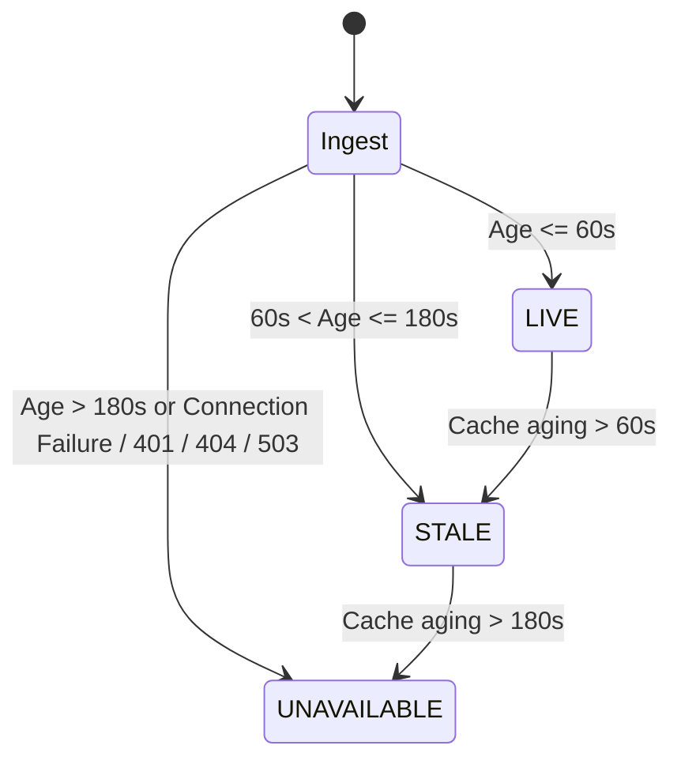

# RailETA — Live Telemetry Freshness Policy & Invariant Specification

> **Document Version**: 1.0.0  
> **Status**: APPROVED & AUDITED  
> **Target Problem Statement**: SIH 26028  
> **Applicable Components**: `src/integrations/railradar.py`, `src/integrations/base.py`, `src/engine/state_correction.py`

---

## 1. Executive Summary & Core Invariant

The integrity of the RailETA system rests on a strict **Zero-Synthetic Telemetry Policy** in live operating mode. Under no circumstances does the engine fabricate coordinates, fake moving train delays, or extrapolate unverified physical positions when operating in `LIVE` mode.

### The Immutable Mode Invariant

| Operational Mode | Permissible Telemetry Source | Failure / Absence Behavior | UI Indicator |
| :--- | :--- | :--- | :--- |
| **`LIVE`** | 100% External live provider pings (RailRadar / RTIS / FOIS). | Transitions strictly to `UNAVAILABLE` (`latitude=None`, `longitude=None`). **Zero synthetic trains.** | `● LIVE` (Green) / `● UNAVAILABLE` (Red/Gray) |
| **`REPLAY`** | 100% Genuine historical train movement logs (Sep 2024 NTES). | Deterministic playback of actual recorded section run times. | `● REPLAY` (Blue) |
| **`SIMULATED / WHAT-IF`** | Explicitly declared counterfactual operational disruption events. | Isolated what-if injection (TSR, caution order, block, signal hold). | `● SIMULATED` (Amber) |

---

## 2. Telemetry Freshness State Machine

Every telemetry packet received from an external observation provider contains two critical timestamps:
1. `source_timestamp`: The UTC instant recorded by the locomotive GPS / signaling transponder.
2. `received_timestamp`: The UTC instant recorded by RailETA ingest gateway.

$$\text{Data Age} = t_{\text{received}} - t_{\text{source}}$$



### Freshness Tier Definitions

### Tier 1: `FRESH` (Active Live State: $\le 60\text{s}$)
- **Operational Meaning**: High-confidence physical confirmation of locomotive position, speed, and track section.
- **Engine Handling**: 
  - Segment progress and live speed directly inform the active section kinematic blend (70% ML baseline, 30% live kinematic traversal).
  - Status displayed as `● LIVE` (Green).
  - Confidence metric: `HIGH` (90%+).

### Tier 2: `AGING` / `STALE` ($60\text{s} < \text{Age} \le 180\text{s}$)
- **Operational Meaning**: Degraded observation. Train may have passed a signal block or entered a cellular/GPS shadow.
- **Engine Handling**:
  - Live speed blending is heavily attenuated (85% ML baseline, 15% kinematic crawl).
  - Section progress is capped to the last confirmed block.
  - Telemetry state is flagged as `STALE`.
  - Confidence metric: `MEDIUM` (70–80%).

### Tier 3: `UNAVAILABLE` ($> 180\text{s}$ or Provider Failure)
- **Operational Meaning**: Upstream observation stream has ceased or credentials are unauthenticated.
- **Engine Handling**:
  - **Zero synthetic telemetry generated**: `latitude=None`, `longitude=None`, `speed_kmph=0.0`.
  - The kinematic state correction is completely bypassed (`is_corrected=False`).
  - The ETA engine falls back gracefully to pure static ML + railway rule schedule propagation.
  - Status displayed as `● UNAVAILABLE` with explicit guidance: *"Live provider unavailable. Switch to REPLAY for historical validation or WHAT-IF for event simulation."*

---

## 3. Auditing & Compliance Assertions

Every prediction emitted by RailETA includes an audit payload:
```json
{
  "provider": "RailRadarLiveProvider",
  "status": "UNAVAILABLE",
  "is_actual_position": false,
  "source_freshness_sec": 999999.0,
  "freshness_level": "STALE",
  "latitude": null,
  "longitude": null,
  "exceptions": [
    "PROVIDER_UNAVAILABLE: No RailRadar API key configured. Zero synthetic telemetry policy enforced."
  ],
  "raw_metadata": {
    "telemetry_mode": "UNAVAILABLE",
    "is_synthetic": false,
    "synthetic_telemetry": false
  }
}
```

This ensures full compliance with SIH Evaluation Guideline §O: **"Never convert UNAVAILABLE into synthetic live state."**
