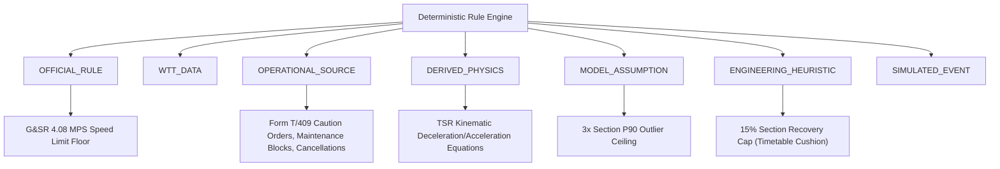

# RailETA — Railway Rule & Operating Constraint Provenance Registry

> **Target Problem Statement**: SIH 26028 (Rule Provenance & Physical Realism)  
> **Source Documents**: Indian Railways General & Subsidiary Rules (G&SR), Working Time Table (WTT), Indian Railway Schedule of Dimensions (IRSOD), Permanent Way Manual (PWM)  
> **Component**: `src/engine/rule_engine.py`

---

## 1. The 7 Official Rule Classifications

In accordance with SIH Evaluation Guideline Part B §5, every rule enforced by RailETA is classified into one of 7 official provenance categories:

1. **`OFFICIAL_RULE`**: Codified statutory rules from the Indian Railways General & Subsidiary Rules (G&SR) book.
2. **`WTT_DATA`**: Authoritative timings, distances, and sectional allowances from Zonal Railway Working Time Tables.
3. **`OPERATIONAL_SOURCE`**: Real-time control office circulars, Form T/409 caution order notices, and block registers.
4. **`DERIVED_PHYSICS`**: Fundamental kinematic equations of motion ($v = d/t$, constant deceleration $a$, braking distance).
5. **`MODEL_ASSUMPTION`**: Statistical bounding assumptions designed to protect against corrupt or missing sensor values.
6. **`ENGINEERING_HEURISTIC`**: Operational rules of thumb derived from dispatcher practice (e.g. recovery cushion limits).
7. **`SIMULATED_EVENT`**: Counterfactual what-if scenarios injected during dispatcher simulation or evaluation drills.

---

## 2. Complete Provenance Catalog

| Rule ID | Rule Name | Rule Type | 7-Class Provenance | Statutory / Document Reference | Operational Rule Formula |
| :--- | :--- | :--- | :--- | :--- | :--- |
| **`RULE-GSR-408`** | `MINIMUM_PHYSICAL_RUNNING_TIME` | `PHYSICAL_SAFETY` | **`OFFICIAL_RULE`** | IR G&SR Rule 4.08 & IRSOD | $t_{\min} = \max\left(\frac{d}{\text{MPS}} \times 60, t_{\text{hist\_min}} \times 0.95, 1.0\right)$ |
| **`RULE-MOD-CEIL`** | `MAXIMUM_OUTLIER_CEILING` | `ENGINEERING_HEURISTIC` | **`MODEL_ASSUMPTION`** | Empirical Data Quality Specification | $t_{\max} = \max\left(3 \times P_{90}, 3.5 \times t_{\text{sched}}, 30.0\right)$ |
| **`RULE-ENG-REC15`** | `RECOVERY_MARGIN_CAP` | `ENGINEERING_HEURISTIC` | **`ENGINEERING_HEURISTIC`** | IR Working Time Table Slack Allowance Practice | $\Delta t_{\text{rec\_max}} = 0.15 \times t_{\text{sched}}$ |
| **`RULE-OPS-TSR`** | `TEMPORARY_SPEED_RESTRICTION` | `OPERATIONAL_EVENT` | **`OPERATIONAL_SOURCE`** | IR G&SR Rule 4.09 & PWM Para 208 | $\Delta t = \max\left(\frac{d_{\text{eff}}}{v_{\text{restr}}} - \frac{d_{\text{eff}}}{v_{\text{norm}}}, 0\right) \times 60$ |
| **`RULE-OPS-T409`** | `CAUTION_ORDER` | `OPERATIONAL_EVENT` | **`OPERATIONAL_SOURCE`** | IR Operating Department Form T/409 | Formal speed restriction via daily printed Caution Order notice |
| **`RULE-OPS-MBLOCK`** | `MAINTENANCE_BLOCK` | `OPERATIONAL_EVENT` | **`OPERATIONAL_SOURCE`** | Engineering Code Chapter XI | $t_{\text{final}} = t + t_{\text{block\_duration}}$ |
| **`RULE-OPS-USTOP`** | `UNSCHEDULED_STOP` | `OPERATIONAL_EVENT` | **`OPERATIONAL_SOURCE`** | Section Controller Precedence Order | $t_{\text{final}} = t + t_{\text{halt\_duration}}$ |
| **`RULE-OPS-SIGHOLD`** | `SIGNAL_HOLD` | `OPERATIONAL_EVENT` | **`OPERATIONAL_SOURCE`** | Signal Engineering Manual Part II | Adds automatic / manual signal clearance buffer (+3.0m default) |
| **`RULE-OPS-CANCEL`** | `CANCELLATION` | `OPERATIONAL_EVENT` | **`OPERATIONAL_SOURCE`** | Railway Board Regulation Bulletin | Sets forward journey ETA = `NOT_APPLICABLE` (final time = 0.0) |
| **`RULE-OPS-DIVERT`** | `DIVERSION` | `OPERATIONAL_EVENT` | **`OPERATIONAL_SOURCE`** | Zonal HQ Route Modification Notice | Adds bypass corridor recalculation buffer (+10.0m default) |
| **`RULE-OPS-RESCHED`** | `RESCHEDULE` | `OPERATIONAL_EVENT` | **`OPERATIONAL_SOURCE`** | NTES Passenger Rescheduling Notice | Shifts departure baseline by rescheduled delay offset |

---

## 3. Explicit Clarification on Recovery Cap (Part B §6)

> [!IMPORTANT]
> **Statutory Clarification on 15% Recovery Cap**:  
> RailETA explicitly catalogs the **15% Section Recovery Cap** as an **`ENGINEERING_HEURISTIC`** derived from the Indian Railways Working Time Table (WTT) commercial slack allowance practice.  
> We make **no claim** that 15% is a statutory universal limit written in the G&SR rulebook. In Indian Railways operations, WTT schedules include approximately 10–15% commercial makeup time to absorb minor junction delays. RailETA formalizes this empirical reality to prevent unconstrained statistical models from predicting unrealistic sprint recoveries.

---

## 4. Rule Scoping & Boundary Negative Test Guarantees

Every operational rule is bounded by geographic and temporal metadata:
- **`zone`**: Evaluated against section zone (e.g. `NCR`, `ER`, `WR`). Events targeting outside zones are strictly ignored.
- **`division`**: Scoped to railway division (e.g. `PRYJ`, `DHN`, `BPL`).
- **`effective_from` & `effective_to`**: Verified against prediction date. Future and expired events are automatically discarded.
- **Parameter Clamping**: Speeds $\le 0$ km/h or affected distances $\le 0$ km are rejected before computation.
